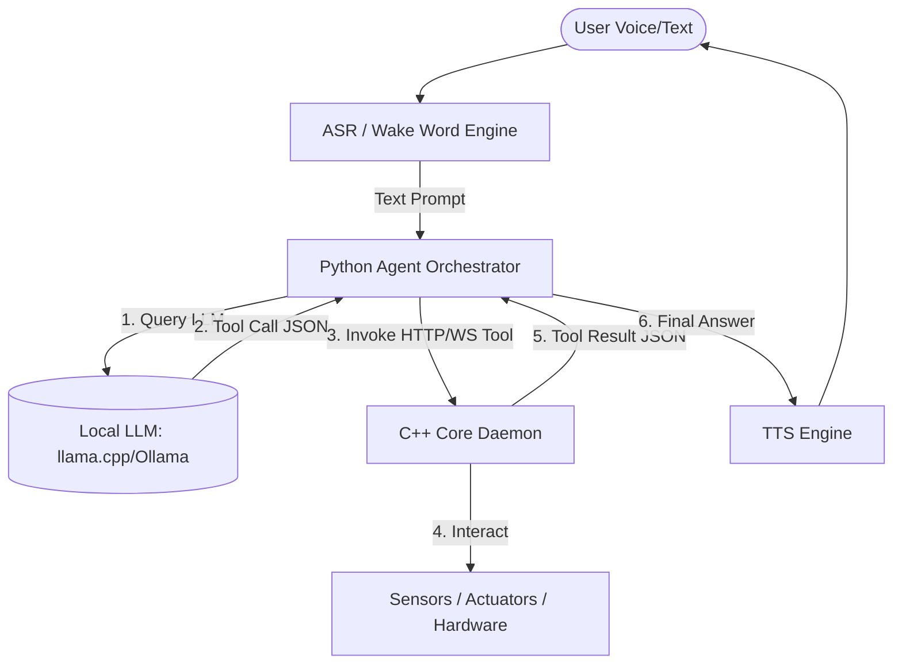
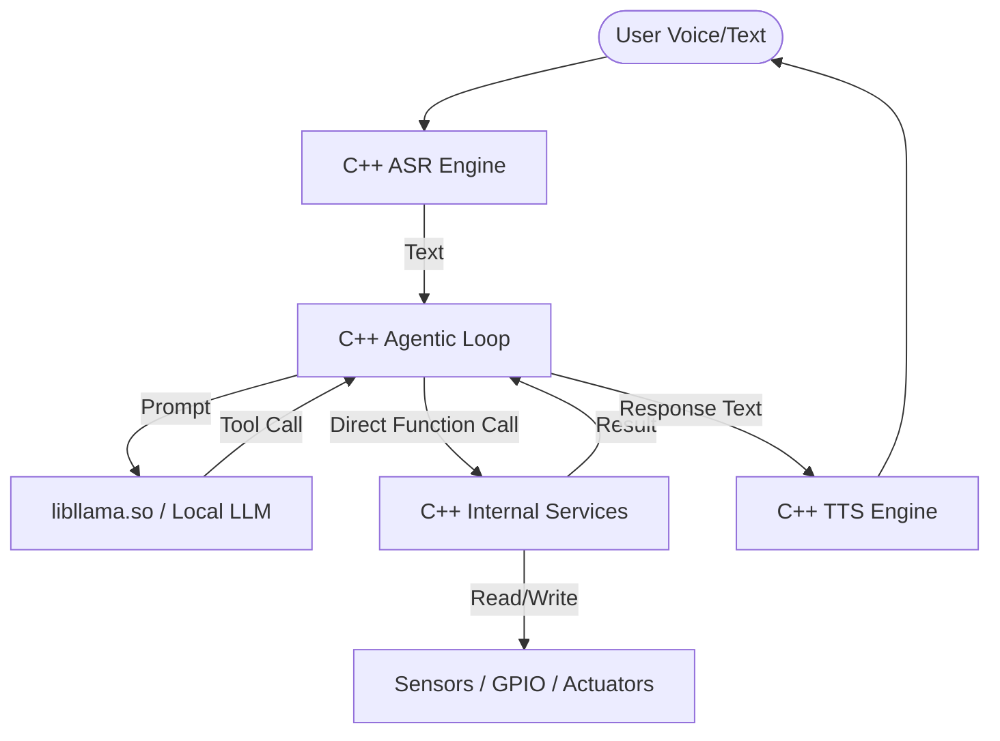
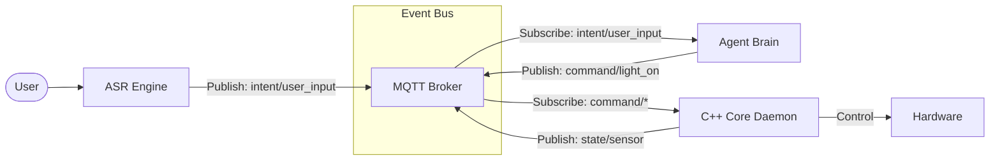

# Agentic Home Assistant Architecture Proposal

To transform the C++ `home_assistant` core from a basic embedded voice command system into a state-of-the-art **agentic home assistant** where an LLM acts as the central brain and invokes underlying services/tools, we evaluate three architectural patterns.

---

## Architectural Options

### Option 1: Hybrid Python Agent + C++ Microservice (Recommended for Iteration)
In this pattern, the C++ service remains a low-level, high-performance controller exposing a local API (REST or WebSockets). A lightweight Python process runs the LLM agent loop, handles tool selection, and calls the C++ API.

* **Pros**:
  * **Development Velocity**: Python has mature agent frameworks (LangChain, LlamaIndex, or lightweight custom tool-calling loops) and libraries for interacting with LLM APIs or local inference (Ollama, llama-cpp-python).
  * **Decoupling**: If the LLM engine crashes or runs out of memory, the core C++ systemd service (monitoring temperature, fire safety, or critical automation) remains completely unaffected.
  * **Modularity**: Easy to swap the Python agent for different models, or run it on a separate machine (e.g. host Mac) during development while C++ runs on the VM.
* **Cons**:
  * **IPC Overhead**: Minor latency (1-5ms) added due to local HTTP/WebSocket loopback.
  * **Resource Footprint**: Running both a C++ service and a Python process increases memory usage.

---

### Option 2: Monolithic C++ Agent (Embedded & High Performance)
In this pattern, the C++ service embeds the LLM inference directly (e.g., linking against `libllama.so` from llama.cpp) and handles the agent loop, tool selection, and tool execution entirely in C++.

* **Pros**:
  * **Maximum Performance**: Zero network/IPC overhead, optimal memory sharing, and direct function-call execution.
  * **Single Binary**: Easier deployment (single systemd service, single compiled binary file).
* **Cons**:
  * **Development Friction**: Writing robust agent logic, parser loops, JSON validation, and complex context management in C++ is highly verbose and error-prone.
  * **Stability Risk**: Memory leaks or crashes in the LLM runtime or tool parser will take down the entire home assistant daemon.
  * **Compile Times**: Linking heavy AI runtimes increases build complexity and compilation times.

---

### Option 3: Event-Driven Agent on MQTT/Event Bus (Highly Decoupled)
In this pattern, the agent and the C++ core do not talk directly. Instead, they share a common MQTT/Event broker. The C++ service publishes sensor readings and device states. The ASR service publishes user intents. The Agent listens to user intents, reasons, and publishes control commands to the broker.

* **Pros**:
  * **High Scalability**: You can add any number of agents, dashboards, logging databases, or sensors without changing existing code.
  * **Fault Tolerance**: The system is completely asynchronous; components can go offline and rejoin without breaking the system.
* **Cons**:
  * **State Synchronization**: Requires a robust schema (like AsyncAPI or standard JSON structures) to ensure all components agree on data formats.
  * **Debugging Complexity**: Harder to trace the synchronous flow of a single user command through multiple asynchronous topics.

---

## Architectural Recommendation

For the **Phase 1 & 2** implementation, we recommend **Option 1 (Hybrid Python Agent + C++ Microservice)**:
1. **C++ Core Daemon**: Focuses on sensor acquisition, thread safety (`HAService`), local log flushes, and exposes a high-performance HTTP/REST and WebSocket API.
2. **Python Agent**: A clean, scriptable agent running locally on the Ubuntu Server that drives the LLM reasoning (via Ollama or local llama-cpp-python), detects tool calls, and makes API requests to the C++ core.

This gives us the safety of C++ for hardware management and the flexibility of Python for AI/LLM experimentation.

---

## Open Design Questions for Discussion
1. **LLM Location**: Do you want to run the LLM fully local on the UTM ARM64 VM (using 4-bit quantized Llama-3-8B / Phi-3-medium, which might be slow on CPU), or do you want to start by calling an external API (like Gemini API, OpenAI, or a local server running on your Mac Host)?
2. **Tool Scope**: What are the first 2-3 C++ services/tools you want the Agent to be able to invoke? (e.g., `GetRoomTemperature`, `GetWeather`, `SetLEDColor`)
3. **Communication Protocol**: Should we use REST HTTP or WebSockets for the C++ to Agent communication? (REST is simpler for tools; WebSockets is better for real-time streaming).
