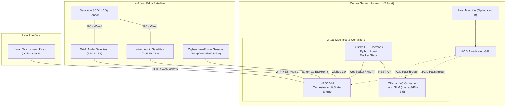

# Local-First Smart Home Architecture Blueprint v3

This blueprint defines the hardware topography, software stack, and networking design for a secure, offline-first home automation and agentic assistant system. It translates the original conceptual PDF blueprint into a concrete implementation roadmap.

---

## 1. Primary Core Goals

*   **Absolute Privacy & Data Sovereignty**: 100% offline local-first operational paradigm. No voice data, environmental logs, calendars, or internal telemetry leaves the local home network.
*   **Architectural Modularity**: Clean decoupling of systems. Lightweight edge hardware handles input/output (mic capture, speaker play, sensor reading), leaving heavy computational pipelines (LLM inference, speech-to-text, and NVR processing) to a central server.
*   **Open Extensibility**: Built entirely on standard interfaces, open-source building blocks, and native APIs, enabling seamless C++ core overrides, custom Python agent loops, and flexible frontend integrations.

---

## 2. Desired Feature Map

*   **Unified Environmental Visualization**: Wall-mounted kiosks displaying a continuous room-by-room matrix tracking temperature, humidity, and CO₂ metrics.
*   **Localized Live Weather Feed**: Secure ingestion of localized outdoor weather data and forecasts fetched from internet-facing public endpoints (without exposing internal network telemetry).
*   **On-Demand Private Voice Assistant**: Interactive local voice query system running completely without internet dependence, parsing environmental stats, handling commands, and playing back system state.
*   **Room-to-Room Intercom Network**: Full-duplex room dialing and direct voice calling across multi-room microphone and speaker stations routed via a local exchange.
*   **Local Productivity Management**: Central tracking of calendars, appointments, and to-do elements, allowing full mutation and retrieval via both the touch dashboard and natural voice commands.

---

## 3. Physical Hardware Topography

### 3.1. Central Server Options (Choose One)

| Component | Option A (Budget SFF) | Option B (Premium Custom SFF) | Option C (Refurbished Gaming PC) - *Best Balance* |
| :--- | :--- | :--- | :--- |
| **Ideal For** | Cost-sensitive setups, easy installation, minimal space footprint. | Heavy LLM reasoning workloads, fast token generation, custom SFF cases. | High AI performance at a lower cost, quiet operation. Great if space is not restricted. |
| **Host PC** | **Refurbished Business SFF PC** *(e.g., Lenovo ThinkCentre / Dell Optiplex)* | **Custom SFF Build** *(Mini-ITX / Micro-ATX build)* | **Refurbished Pre-built Gaming PC** *(e.g., HP Victus / Lenovo Legion / Dell G5)* |
| **CPU** | Intel Core i5 / i7 (10th - 12th Gen) | AMD Ryzen 5 7600 / Intel Core i5-12400 | Intel Core i5 (11th-13th Gen) / Ryzen 5 5600/7600 |
| **RAM** | 32GB DDR4 | 32GB - 64GB DDR5 (Dual-Channel) | 32GB DDR4 or DDR5 (may require upgrading stock 16GB) |
| **Storage** | 1TB SATA or NVMe SSD | 1TB - 2TB NVMe Gen4 SSD | 1TB NVMe SSD |
| **NVIDIA GPU** | **NVIDIA RTX 3050 6GB Low Profile** | **NVIDIA RTX 4060 8GB Low Profile** | **NVIDIA RTX 4060 8GB (Full-Size)** |
| **GPU Power** | **70W (PCIe Slot Powered)** *Runs immediately on stock SFF power supply.* | **115W (Requires 8-pin PCIe cable)** *Requires custom SFX power supply.* | **115W (Standard PCIe connector)** *Runs on pre-installed gaming power supply.* |
| **Local AI Speed** | ~15-20 tokens/sec (8B quantized) | ~40+ tokens/sec (8B quantized) | ~40+ tokens/sec (8B quantized) |
| **NVR Support** | Offloads video stream analytics via CUDA / TensorRT. | Handles many high-res camera streams natively via TensorRT. | Handles many high-res camera streams natively via TensorRT. |
| **Est. Host Cost**| **~$410** | **~$860** | **~$550 - $650** |

> [!TIP]
> **Buying Used RTX 4060 LP Cards**:
> You can frequently find used Gigabyte RTX 4060 OC Low Profile 8G cards on markets like eBay or r/hardwareswap for **~$200 to ~$230** (saving around $70–$100 off retail). 
> 
> * **Downside / Risk**: Low-profile cards use **three tiny 40mm/50mm fans** running at very high RPMs to keep the card cool in compact spaces. Used cards may have worn-out fan bearings (causing loud whirring or rattling noises) or dried-out thermal paste/pads. Additionally, due to high demand in Small Form Factor (SFF) communities, used LP cards sell quickly and hold their value, offering smaller discounts compared to standard dual-fan desktop cards.
> * *Note*: A used RTX 4060 LP **still requires the 8-pin PCIe power connector** and cannot be used in Option A's refurbished business SFF PCs without power supply modifications.

---

### 3.2. Wall Display Options (Choose One)

*   **Option A: Android Kiosk Tablet (Consumer Kiosk)**
    *   *Hardware*: 8" to 10" Android Tablet (e.g., Lenovo Tab or Samsung Galaxy Tab).
    *   *Software*: **Fully Kiosk Browser** locks down the system, exposes a control REST API to Home Assistant, and utilizes the tablet’s front camera for motion-based screen activation.
    *   *Power Safety*: The tablet charger must be plugged into a Zigbee smart plug. A Home Assistant automation will cycle the plug (ON when battery drops below 20%, OFF when battery exceeds 80%) to **prevent battery swelling**.
*   **Option B: SBC Kiosk Panel (Battery-less / Industrial Kiosk) - *Recommended***
    *   *Hardware*: **Raspberry Pi 4/5** paired with a wall-mounted touchscreen (e.g., official Raspberry Pi 7" display, or a waveshare 10.1" HDMI touch panel).
    *   *Software*: Boots into a lightweight Linux distribution (e.g., Raspberry Pi OS Lite) configured in kiosk mode running Chromium pointing to the Home Assistant dashboard.
    *   *Power Safety*: Powered over a single Ethernet cable using a **PoE HAT**. Completely eliminates battery swelling risks.

---

### 3.3. In-Room Audio Satellites

*   **Primary Living Areas (Far-field Voice Command)**:
    *   *Hardware*: **Espressif ESP32-S3-BOX-3**.
    *   *Features*: Integrated dual-microphone array, hardware Acoustic Echo Cancellation (AEC), offline wake-word recognition, and a small touchscreen for room controls. It allows you to speak commands even while the speaker is playing responses.
*   **Standard Rooms (Intercom & Voice Command)**:
    *   *Hardware*: **ESP32-S3 microcontroller nodes** (e.g., M5Stack Atom Echo, or custom development boards with INMP441 I2S microphones and MAX98357A I2S amplifiers).
    *   *Software Configuration*: Satellites run ESPHome firmware utilizing the **microWakeWord** engine. Wake-word detection runs locally on the chip; audio is only streamed to the server *after* detection, saving network bandwidth.

---

### 3.4. Room-Level Sensors

*   **Air Quality Monitoring**:
    *   *Hardware*: **Sensirion SCD4x** (Photoacoustic NDIR CO₂ sensor).
    *   *Integration*: Connected via I2C to the ESP32 audio satellites. Since the photoacoustic sensor is relatively power-hungry, it leverages the satellite’s wired 5V/USB power supply.
*   **Ambient Temperature, Humidity, and Motion**:
    *   *Hardware*: Battery-powered **Zigbee/Thread end-devices** (e.g., Aqara, Sonoff, or Tuya).
    *   *Benefit*: Peel-and-stick placement, years of battery life, mesh network routing, and zero overhead on the Wi-Fi router.

---

## 4. System Software Topology

*   **Host OS**: **Proxmox VE** (Debian-based hypervisor). Runs bare-metal on the central server, providing robust virtualization, snapshots, and PCIe device passthrough.
*   **Orchestration VM**: **Home Assistant OS (HAOS)**. Runs in a dedicated VM with PCIe passthrough for the Zigbee USB coordinator. Manages device states, automation scripting, SQLite database logs, and localized voice pipelines (Whisper STT / Piper TTS).
*   **Inference Container**: **Ollama (LXC Container)**. Mounts the host’s NVIDIA GPU using standard LXC GPU passthrough rules. Runs local models (like Llama-3 8B or Phi-3.5-mini) to handle structured voice agent function calls.
*   **Bespoke C++ Core Daemon**: Runs inside a Docker container. Exposes a high-performance C++ REST/WebSocket API (`HAService`) to bridge physical inputs, logging, and events with the Python Agent loop and Home Assistant.
*   **Edge Node Runtimes**: **ESPHome**. Lightweight C++ firmware compiled and pushed directly to the ESP32-S3 satellites.

---

## 5. Network Topology (Hybrid Approach)

To ensure high-throughput and avoid 2.4GHz Wi-Fi network congestion (which degrades real-time voice streaming), a **hybrid wired/wireless** scheme is employed:

1.  **Wired Infrastructure (PoE Ethernet)**:
    *   *Nodes*: Central Server, Wall Display Client (Option B), and Primary Audio Satellites (e.g., Olimex ESP32-POE).
    *   *Purpose*: Guarantees zero-packet-loss audio transmission, ultra-low latency, and continuous PoE power without battery failure points.
2.  **Wireless Sensor Infrastructure (Zigbee 3.0 / Thread)**:
    *   *Nodes*: Temperature/humidity, motion, contact, and water leak detectors.
    *   *Coordinator*: A USB Zigbee coordinator (e.g. Sonoff ZBDongle-E) plugged into the central server using a **1.5m to 2m USB extension cable** to isolate the antenna from the host PC's USB 3.0 RF noise.
3.  **Wireless Fallback (Wi-Fi 2.4GHz)**:
    *   Used only for secondary ESP32 satellites located in spaces where running Ethernet cables is physically impossible.

---

## 6. Overall System Cost Estimate

To help you plan, here is a complete cost breakdown for the entire hardware ecosystem. The calculations are based on a **3-room home layout** (e.g., Living Room, Main Bedroom, and Office) including security/automation sensors.

### 6.1. Component Unit Price Reference

| Component Group | Specific Items & Pricing | Estimated Subtotal |
| :--- | :--- | :--- |
| **Zigbee Coordinator** | <ul><li>Sonoff ZBDongle-E USB Coordinator: ~$30</li><li>1.5m USB extension cable: ~$5</li></ul> | **~$35** |
| **Edge Audio Satellites** | <ul><li>1x Espressif ESP32-S3-BOX-3 (Living Room): ~$50</li><li>2x M5Stack Atom Echo (Bedroom/Office): ~$30 ($15 each)</li><li>USB power bricks & cords: ~$15</li></ul> | **~$95** |
| **Sensors & IAQ** | <ul><li>2x Sensirion SCD40 CO₂ Sensors (wired to ESP32s): ~$70 ($35 each)</li><li>3x Zigbee Temp/Humidity Sensors: ~$36 ($12 each)</li><li>2x Zigbee Motion Sensors: ~$30 ($15 each)</li><li>3x Zigbee Door Contact Sensors: ~$30 ($10 each)</li></ul> | **~$166** |

---

### 6.2. Overall Build Tier Estimates

#### Tier 1: The Budget / Value Setup (Option A Host + Option A Display)
This tier targets maximum reliability and functionality per dollar spent, utilizing a highly capable refurbished server and an automated consumer wall tablet.

*   **Central Server** (Refurbished SFF PC + RTX 3050 LP 6GB): **$410**
*   **Zigbee USB Coordinator & Cabling**: **$35**
*   **Wall Display Option A** (8" Android Tablet + Mount + Zigbee Smart Plug + Fully Kiosk license): **~$165**
*   **Edge Audio Satellites** (3 rooms): **$95**
*   **Sensors & IAQ** (3 rooms + doors/motion): **$166**
*   **TOTAL SYSTEM ESTIMATE**: **`~$871`**

#### Tier 2: The Premium / High Performance Setup (Option B Host + Option B Display)
This tier targets cutting-edge generative AI speeds, high-throughput VRAM, and a completely battery-less, wall-mounted display panel powered over PoE.

*   **Central Server** (Custom modern SFF PC + RTX 4060 LP 8GB): **$860**
*   **Zigbee USB Coordinator & Cabling**: **$35**
*   **Wall Display Option B** (Raspberry Pi + PoE Hat + Waveshare 10" touchscreen + Wall mount enclosure): **~$210**
*   **Edge Audio Satellites** (3 rooms): **$95**
*   **Sensors & IAQ** (3 rooms + doors/motion): **$166**
*   **TOTAL SYSTEM ESTIMATE**: **`~$1,366`**

#### Tier 3: The Best Balance Setup (Option C Host + Option B Display) - *Highly Recommended*
This tier pairs the lower cost of a pre-assembled refurbished gaming PC (with a full-size, quiet RTX 4060 8GB) with the battery-less wall display client (Option B).

*   **Central Server** (Refurbished Pre-built Gaming PC + Full-Size RTX 4060 8GB): **~$600**
*   **Zigbee USB Coordinator & Cabling**: **$35**
*   **Wall Display Option B** (Raspberry Pi + PoE Hat + Waveshare 10" touchscreen + Wall mount enclosure): **~$210**
*   **Edge Audio Satellites** (3 rooms): **$95**
*   **Sensors & IAQ** (3 rooms + doors/motion): **$166**
*   **TOTAL SYSTEM ESTIMATE**: **`~$1,106`**

