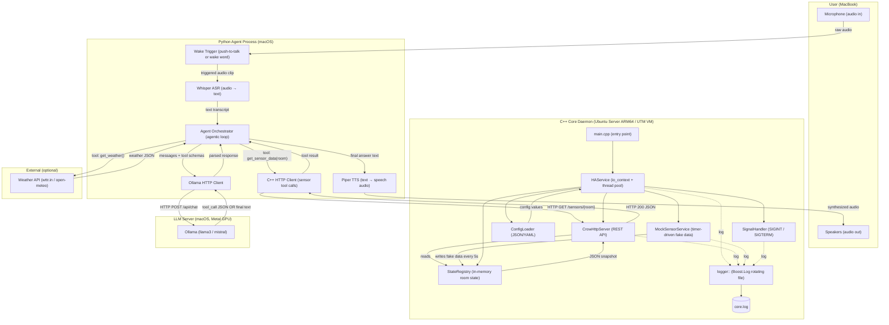
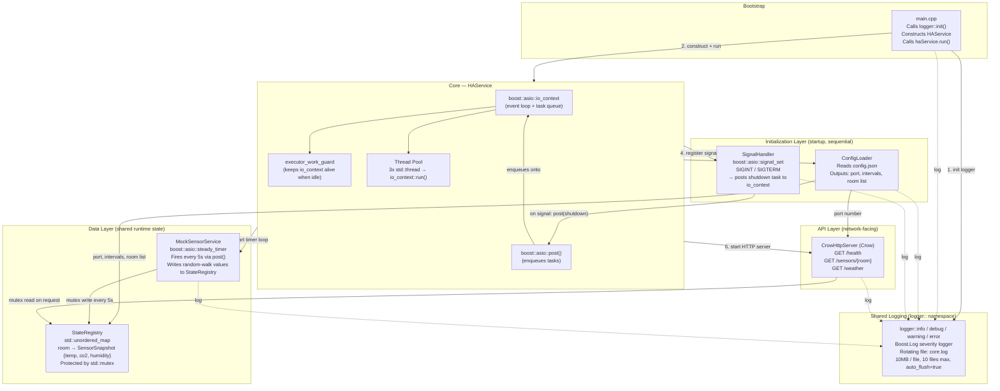
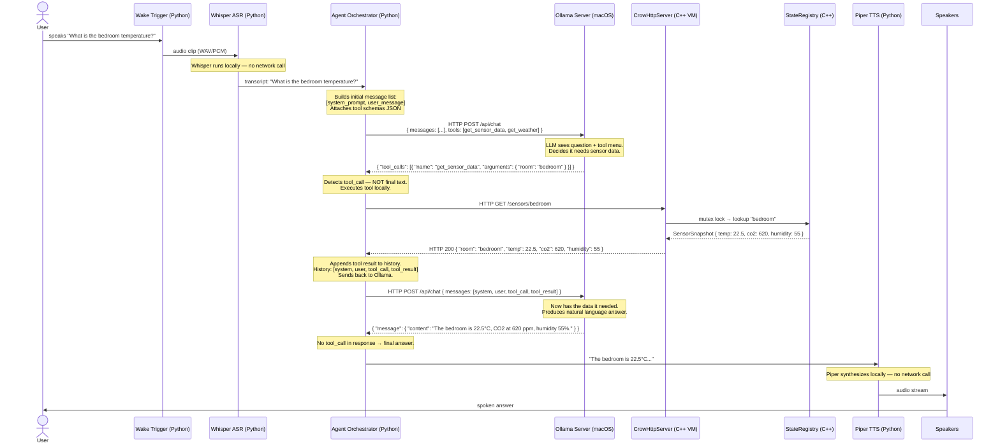
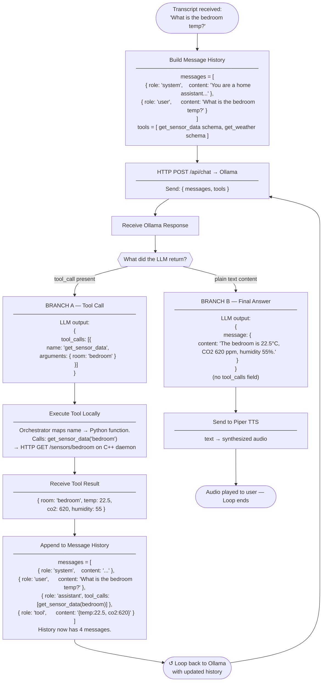

# Phase 1 System Architecture

This document contains four layered architecture diagrams for the Phase 1 home assistant system,
from the whole-system view down to the internal agentic loop.

---

## Diagram 1 — Whole System Overview

> What processes exist and how do they connect?



Three separate runtime processes — C++ daemon (VM), Python agent (macOS), Ollama (macOS Metal GPU)
— communicate entirely over HTTP. This makes each independently restartable and replaceable.
C++ never touches AI; Python never touches hardware.

---

## Diagram 2 — C++ Internal Services Architecture

> How does the C++ daemon organize its own services?



`HAService` is the single owner and wiring point — it bootstraps services in a fixed order (1–6)
so nothing starts before its dependencies are ready. `StateRegistry` sits behind a `std::mutex`
because `MockSensorService` writes from a timer thread while `CrowHttpServer` reads from HTTP
request threads — these can be concurrent.

---

## Diagram 3 — Voice Command End-to-End Sequence

> In what exact order do data and messages flow for a single voice command?



Notice Ollama is called **twice**: first to decide what data is needed, second to produce the
answer once that data arrives. The C++ daemon is only involved for one short synchronous exchange.
Whisper and Piper never touch the network.

---

## Diagram 4 — Agentic Loop Deep Dive

> How does the AI decide what to do, and when to stop?



### Understanding the Agentic Loop

An LLM is strictly text-in, text-out — it cannot call a function, read a sensor, or make an HTTP
request on its own. So you give it a **tool schema list** alongside the user's question: each
schema is a small JSON object describing a function name and its parameters, like a menu of
available capabilities. When the LLM realizes it needs data to answer, instead of guessing, it
outputs a specially formatted JSON block saying *"I want to call `get_sensor_data` with
`room = bedroom`"*. This is not code execution — it is just text that happens to look like JSON.

Your Python **orchestrator** is the trusted execution layer. It reads the LLM's output, detects
whether it's a tool call or a final answer, and if it's a tool call, maps the name to a real Python
function and actually executes it (making the HTTP call to C++). The LLM never touches your sensor
— it only expresses intent.

The key to multi-step reasoning is **message history**. The orchestrator does not start a new
conversation after each tool call — it appends both the LLM's tool call and the real result as new
messages in the same growing list, then sends the entire history back to Ollama. After one
round-trip the history is `[system, user_question, assistant_tool_call, tool_result]`. The LLM
now has context + data, so on the next call it can produce a grounded answer. If a question needs
two tools (e.g. sensor data *and* weather), the loop runs twice before producing a final answer.

The **exit condition** is simple: the loop stops when the LLM returns a message with a plain
`content` string and no `tool_calls` field. That's the final answer, ready for TTS. This pattern
is called **ReAct (Reason + Act)** or **function calling** depending on the framework, but the
mechanic is always the same: LLM produces intent → orchestrator executes → result fed back →
repeat until final answer.

**Example of growing message history across two tool calls:**

```
Round 1 — LLM decides it needs sensor data:
  messages = [
    { role: "system",    content: "You are a home assistant..." },
    { role: "user",      content: "What is the bedroom temp and today's weather?" }
  ]
  → LLM returns: tool_call get_sensor_data(bedroom)

Round 2 — After sensor result, LLM decides it also needs weather:
  messages = [
    { role: "system",    content: "..." },
    { role: "user",      content: "..." },
    { role: "assistant", tool_calls: [get_sensor_data(bedroom)] },
    { role: "tool",      content: '{"temp": 22.5, "co2": 620}' }
  ]
  → LLM returns: tool_call get_weather()

Round 3 — After weather result, LLM produces final answer:
  messages = [
    { role: "system",    content: "..." },
    { role: "user",      content: "..." },
    { role: "assistant", tool_calls: [get_sensor_data(bedroom)] },
    { role: "tool",      content: '{"temp": 22.5, "co2": 620}' },
    { role: "assistant", tool_calls: [get_weather()] },
    { role: "tool",      content: '{"condition": "Cloudy", "temp_outside": 14}' }
  ]
  → LLM returns: "The bedroom is 22.5°C. Outside it's cloudy at 14°C."
```

---

---

## Potential Challenge 1 — Audio Input Sanitization

Raw microphone audio fed directly into Whisper produces poor transcription results in realistic
home environments. The following preprocessing stages are needed between wake word detection and ASR.

### Required preprocessing pipeline

```
Mic → [Resample to 16kHz mono 16-bit PCM] → [AEC] → [Noise Suppression] → [VAD gate] → Whisper
```

| Stage | Problem it solves | Recommended library |
|---|---|---|
| Resample + convert | Whisper requires 16kHz mono 16-bit PCM. Mics often capture 44.1kHz stereo | `libsamplerate`, `soundfile`, or SoX |
| AEC (Acoustic Echo Cancellation) | TTS speaker output leaks back into the mic. Without AEC, Whisper transcribes its own responses | WebRTC APM (C++), `webrtcvad` (Python) |
| Noise suppression | Background noise (appliances, HVAC) causes hallucinated transcripts | RNNoise (Mozilla) — lightweight, runs well on ARM |
| VAD (Voice Activity Detection) | Silence and trailing noise fed to Whisper increases latency and error rate | Silero VAD, WebRTC VAD |
| AGC (Automatic Gain Control) | Quiet speech from across a room drops below Whisper's reliable threshold | WebRTC APM or `pyaudio` gain stage |

### Key notes

- **AEC is the most critical** for this architecture. Because TTS playback and mic input share the same
  room, every spoken response is re-captured. AEC requires a reference signal from the playback
  device so it can subtract the known output from the mic input.
- VAD prevents the wake word clip from containing long silence tails, which inflate Whisper's
  processing time significantly.
- This preprocessing layer sits entirely within the Python voice pipeline — no C++ changes required
  for Phase 1. Can be added as a `AudioPreprocessor` stage between `WakeWordDetector` and `WhisperASR`.

---

## Potential Challenge 2 — Linux Satellite Audio Devices

Deploying the voice pipeline to a Linux machine with external (satellite) mic/speaker devices
introduces a distinct set of challenges compared to a single macOS machine.

### Audio subsystem choice

Linux's audio stack is layered: ALSA at the kernel level, PulseAudio or PipeWire on top.

| Stack | Notes |
|---|---|
| ALSA alone | Lowest latency, no automatic mixing or routing. Manual device selection required. |
| PulseAudio | Stable, widely supported. Being phased out on newer Ubuntu. |
| **PipeWire** (recommended) | Unified graph handling USB, Bluetooth, HDMI, and ALSA. Default on Ubuntu 22.04+. Supports virtual nodes and filter chains for routing. |

### Stable device addressing

USB mic and speaker device indices (`/dev/snd/pcmC1D0`) are not stable across reboots or
hot-plug cycles. Selection must use PipeWire/PulseAudio node names or ALSA card names, not
numeric indices. This requires a device registry config (see below).

### Bluetooth satellite devices

- **A2DP** profile: high-quality audio output only — cannot be used for mic input.
- **HFP/HSP** profile: provides both mic and speaker but at degraded quality (8–16kHz). Not suitable for Whisper without resampling.
- SBC codec adds ~150–200ms latency to TTS playback.
- BT connections drop and renegotiate codec unpredictably — the audio session must handle reconnection gracefully without crashing the pipeline.

### Hot-plug handling

Devices connect and disconnect at runtime. The Python voice pipeline must subscribe to PipeWire
or udev events to detect new devices and reassign audio source/sink assignments dynamically,
rather than hard-coding device handles at startup.

### Far-field microphone arrays

Devices such as ReSpeaker or Matrix Creator expose multi-channel ALSA input (e.g., 6 channels).
The processed beamformed audio is typically on a specific channel (channel 0 or a dedicated
capture stream). This requires driver setup and a custom ALSA/PipeWire capture configuration —
the pipeline cannot treat these as a standard single-channel mic.

### Multi-room routing

If satellite devices exist in multiple rooms, the orchestrator must route TTS output to the
speaker closest to the room where the wake word was detected. This is non-trivial and requires:

1. A **device registry** config mapping room names to PipeWire node names.
2. Orchestrator logic to select the target output device per response.
3. Possibly a dedicated `AudioRouter` component in the Python agent process.

### Summary table

| Challenge | Severity | Mitigation |
|---|---|---|
| Stable device addressing | Medium | Use PipeWire node names in config; avoid ALSA indices |
| AEC with satellite speaker | High | WebRTC APM with reference signal from playback device |
| Bluetooth latency + dropout | Medium | Prefer USB/wired for satellite audio; BT for speakers only |
| Hot-plug handling | Medium | PipeWire event subscription or udev watcher in Python |
| Multi-room routing | High | Room-to-device map in config + `AudioRouter` in orchestrator |
| Far-field mic arrays | Medium | Per-device ALSA config + driver setup; document per device model |

### Architectural addition required

A **device registry** — a config-driven map of room names to audio device identifiers — is needed
before satellite deployment. It belongs either as a section in `config.json` (read by `ConfigLoader`
and exposed via a REST endpoint) or as a standalone config file consumed by the Python agent.

```json
{
  "audio_devices": {
    "bedroom":  { "mic": "alsa_input.usb-bedroom-mic",  "speaker": "alsa_output.usb-bedroom-spk" },
    "kitchen":  { "mic": "alsa_input.usb-kitchen-mic",  "speaker": "bluez_output.kitchen-bt-spk" },
    "living_room": { "mic": "alsa_input.usb-lr-mic",   "speaker": "alsa_output.hdmi-lr-tv" }
  }
}
```

---

## Reading Guide

| Diagram | Zoom Level | Primary Question Answered |
|---|---|---|
| 1 — System Overview | Whole system, all processes | What processes exist and how do they connect? |
| 2 — C++ Internals | Inside the daemon | How does the C++ daemon organize its own services? |
| 3 — Voice Sequence | One complete request, chronological | In what exact order do messages and data move? |
| 4 — Agentic Loop | One sub-component, iterative logic | How does the AI decide what to do and when to stop? |

## Phase 1 C++ Services Summary

| Service | Responsibility | Key Dependency |
|---|---|---|
| `HAService` | Owns io_context, thread pool, wires all services | Boost.Asio |
| `SignalHandler` | SIGINT/SIGTERM → post clean shutdown | Boost.Asio signal_set |
| `ConfigLoader` | Reads config.json at startup | nlohmann/json or yaml-cpp |
| `StateRegistry` | In-memory room → sensor snapshot map | std::mutex |
| `MockSensorService` | Timer-driven random-walk sensor data | Boost.Asio steady_timer |
| `CrowHttpServer` | REST API: /health, /sensors/{room}, /weather | Crow (header-only) |
| `logger::` | Shared logging sink (already implemented) | Boost.Log |
